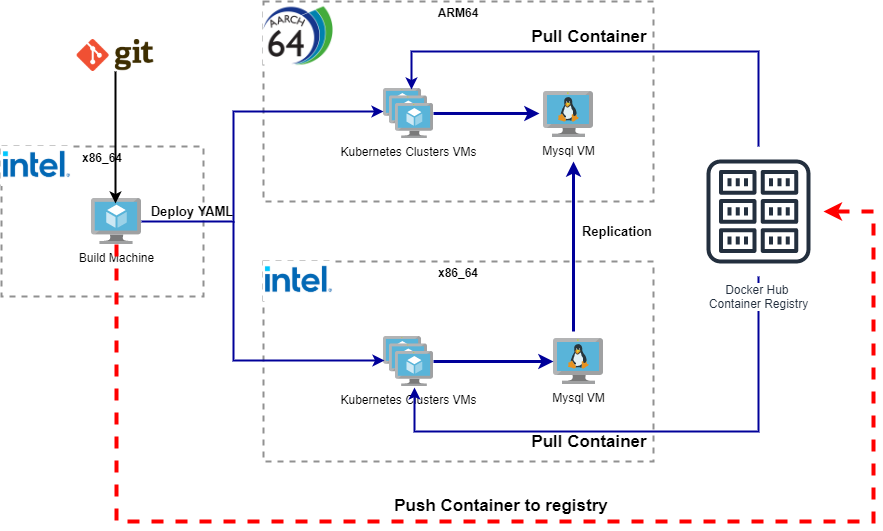
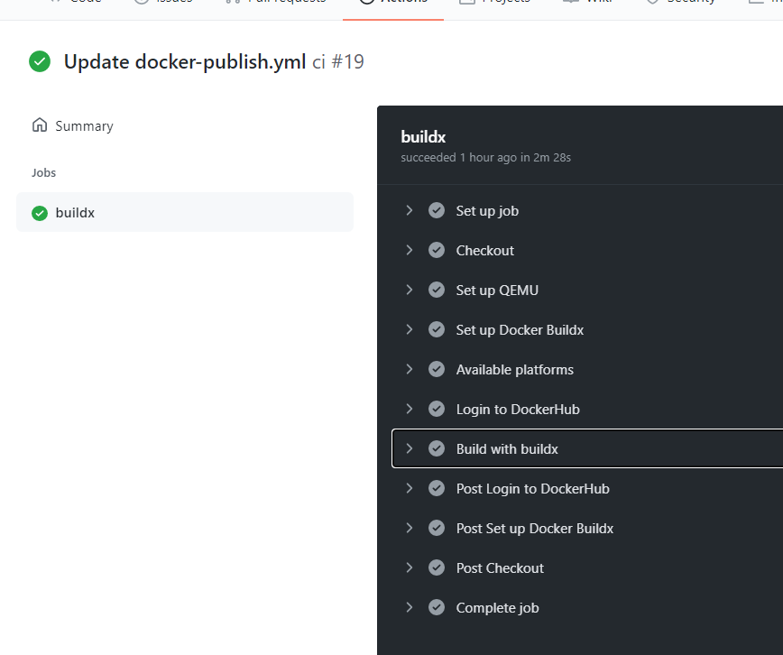
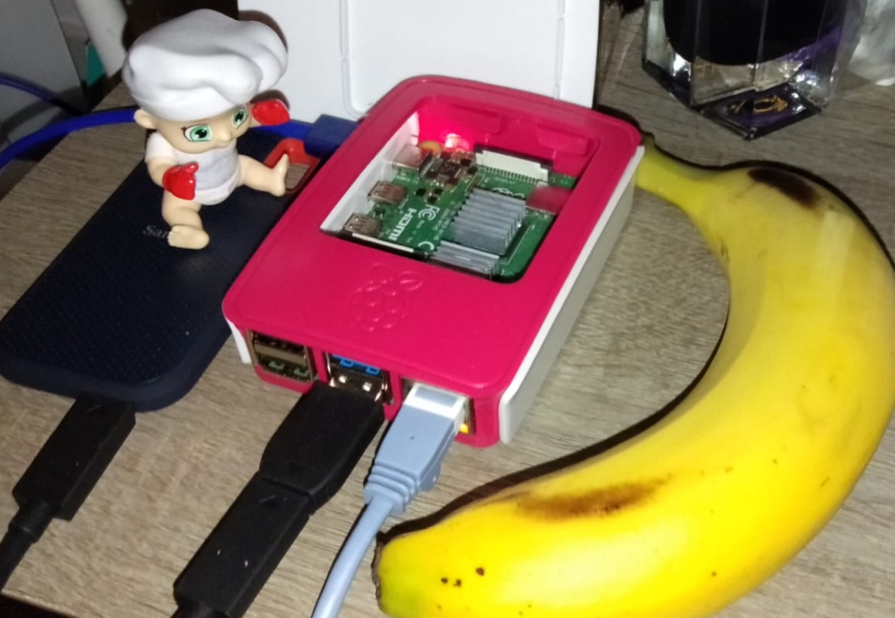
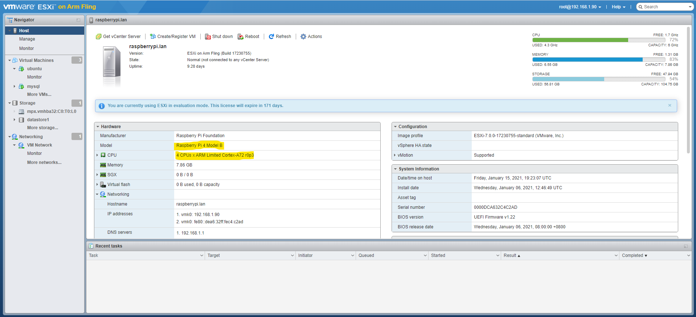
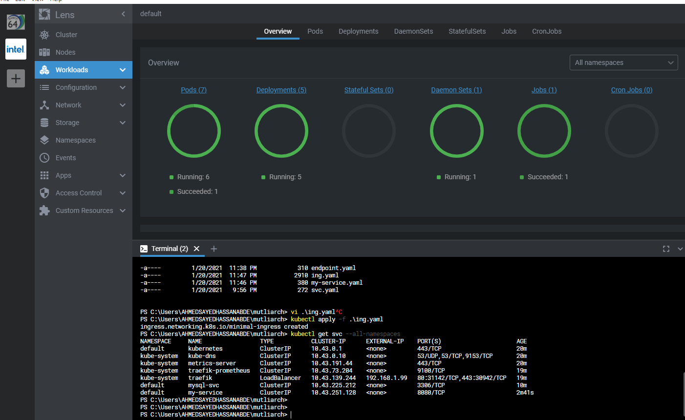

# Build a Hybrid Application beyond x86, using buildah and podman

This article audience mainly Cloud native engineer and architect, with  knowledge to containers and Kubernetes, the following section intented to give brief about ISA and multiarch please skip ahead to section " Options to build multiarch container images" for the technical part.

## Why do we need to consider Multiarch hybrid applications

The simple answer let us put everything on x86 and go with it, the answer to that needs a look at past, present and the future.

### Past
Enterprises and Large system used to run on Mainframe, a large computer with a large amount of memory, but with increasing Personal Computer (a.k.a) Microcomputer, more CPU started to Mass produced to fit inside a box that lay on the Desktop.

The Microcomputer CPUs started to make their way to Enterprise applications. With the introduction of the distributed system, the x86 machines began to dominate the Enterprise applications with distributed systems' success. Stewart Alsop II famously predicted that the last Mainframe would be unplugged on March 15, 1996. This prediction turns out to be very wrong with IBM introducing IBM Z15 in September 2020. IBM Z and Mainframe turns out to be very much alive and striving. Running a Legacy application very reliable, and the Mainframe is packed with considerable computing power in a small footprint compared to distributed x86_64 systems.


### Present
Public Cloud and Hyperscaler become the new normal for hosting Enterprise application, with apparent domination of x86_64 ISA from Intel Xeon and AMD EPYC. Still, the demands for specialized workloads and hosting from businesses make the public cloud provider introduce different Machines such as IBM power, IBM Z, and Amazon ARM.


### Future Kind of :).
Nowadays, we are in the Era of 5G and IoT, with increased Edge computing demands derive the demand of Power-efficient machines, also the success of Heterogeneous computing
introducd initially in Mobile devices, ARM machines start to get back to the PC market and move toward Servers and Enterprise Applications.

The previous introduction is trying to demonstrate why there is a need for multiarch deployments; if you are building an application, asset, or even custom enterprise solution, you may still face a demand to deploy it on none x86 machines, so what is the other options we have now? before answering that just a quick detour around what is the ISA?

## Introducing Instruction set Architecture (ISA) 
https://www.computerhope.com/jargon/i/instset.htm

The instruction set, also called ISA (instruction set architecture), is part of a computer that pertains to programming, which is more or less machine language. The instruction set provides commands to the processor to tell it what it needs to do. The instruction set consists of addressing modes, instructions, native data types, registers, memory architecture, interrupt and exception handling, and external I/O.

In early 1960, IBM used to have a series of incompatible families, but with the introduction of IBM System 360, the grandparent of IBM Z/Architecture, IBM standardized their Mainframe. IBM System 360 is The	first	true	ISA	designed as a portable hardware-software interface.

## ISA landscape today

Will list some of the CPU, there is many other such as SPARC, RISC, MIPS, .. etc. 
But here, I will list the machines that are easily accessible via owning a device or provided as a self-service on the public Cloud.

Note Definition in Linux on what comes when you execute "uname -m", for those ISA that is used within this article there are other names for different generation, not the scope to cover them here.

### IBM Z  
IBM Z is the latest generation of the System/360 introduced in 1964, currently used in IBM Z Mainframe.
Still, you do not need to purchase an expensive mainframe to try. IBM Cloud introduces Hyper Protect Virtual Server, https://cloud.ibm.com/catalog/services/hyper-protect-virtual-server 
which gives access to IBM Z Machines running Linux One.
* Strengths: Handle Intensive IO operations, such as Credit card swipes.
* Definition in Linux: s390x
* Trivia: In z/architecture, the Z stands to Zero downtime.

### x86
Developed by Intel and currently produced mainly by Intel and AMD, it provides a large family of processors covering a broad spectrum of mobility, laptop, workstation, and High-Performance Servers.
* Strengths: General purpose computing, the defacto standard for all software.
* Definition in Linux:  x86_64
* Trivia: Even Intel is the one who created x86,and licensed to other companies such as AMD and Cyrix, AMD is the one who defines x86_64, the 64-bit extension, after the limited success of IA_64 in the consumer, and intel ended up license AMD64 from AMD.

### Power ISA
Developed by the AIM alliance, AIM refers to Apple, IBM, and Motorolla, to create RISC machines. PowerPC used to be the standard CPU in Apple products till 2005. PowerPC was the CPU used in many consumer products such as Playstation 3, xbox360, and Nintendo Wii, currently it is part of OpenPower Foundation and is introduced in IBM pSeries servers, also it is available on  IBM public cloud as PAYGO self services virtual servers.[https://cloud.ibm.com/catalog/services/power-systems-virtual-server]
* Strengths: with IBM power 10, IBM claims its main advantage is to provide faster AI inference.
* Definition in Linux: ppc64el
* Trivia:  Power2 was the CPU used in Deepblue, the first machine to win chess, Kasparov. Also, Power7 was the CPU behind the machine that won the first Jeopardy.


### ARM
Developed by Acorn computer, to be used in the BBC Microcomputer produced by Acorn Computers,   ARM engineer designed the CPU to be power-efficient. The goal back then is to replace the expensive ceramic package and heatsink with a cheaper plastic package.
To get your hands on a machine running ARM, hold your phone. or get a Raspberry Pi. Also, Amazon EC2 based ARM Graviton. [https://aws.amazon.com/blogs/aws/new-ec2-instances-a1-powered-by-arm-based-aws-graviton-processors/]

* Strengths: Power efficiency.
* Definition in Linux: aarch64
* Trivia: according to Steve Furber, the principal designer on ARM, when they received the first chip, they tested the power consumption and found it Zero, he reviewed the wiring, thinking that the meter is not connected correctly it turned out they did not connect the CPU to the power supply at all, because of faulty board, and it is running only on the power coming from the input signal.

## Options to build multiarch container images

Now it comes to the moment of what should I do make my containerized application run on multiarch, in here will cover four different approaches 

- Do nothing it will work
- Build everything on its own dedicated machine
- Cross Build and Cross compiling 
- User space emulation
### Options 1: Do nothing it will work 
This the most forward way to think, currently most of the application is written in Architecture agnostic language, Java for example come with slogan compile once run anywhere, also Python, Node.JS, all supported and ported to previous ISA and more.
Bringing this to the container world should as simple as 

```
 podman run -it python python -c 'print("Hello world!")'
```

and this command will run correctly on mostly all commercial Machines, but this only possible because the python image on docker.io itself is multiarch,

when running it, podman will pull the proper image that match you arch and as soon as you build a custom image as simple as 

Creat a dockr file just pulling Python Image
```
FROM python
```

Build and push it 

```
buildah build-using-dockerfile -t ahmadhassan83/simplypy86 
podman push 
```

Then try to run the exact same comman on Arm Machine 


```
 podman run ahmadhassan83/simplypy86 python -c 'print("Hello World")'
```

Will it run or Not ???!!!

The answer is NO, and give the following error 

```
standard_init_linux.go:219: exec user process caused: exec format error
```

It will no longer work on any other different architecture because it is a custom image, pulled and created by default according to the computer you you use.

So with this option we did not do any actual building for container image even the simplest image failed to run.

### Options 2: Build everything on its own dedicated machine

This is a no brainer option, Just simply pick the proper machine may be it sounds like an expensive idea, but still with Cloud offerings, as elaboratoed in the previous section, you can rent a machine in hourly and/or monthly rate for most commonly used CPU such as s390x, aarch64, ppc64el, and x86.

Still picking a dedicated machine for build may add operational complexity, another options to run on emulation on any x86 machine using qemu system. for those who do not know Qemu can emulate most of the CPU in the market, unfortunaty this option may sound attractive still emulating a compelete machine take resources, and still require additional operation, and running a compelete system in emulation will decrease the performance significantily.

To give a sense of the performance impact of emulation find below some numbers I got from benchmarking s390x a machine on emulation vs the machine running on cloud, in this test I ran ubuntu 18.04 on s390x and benchmarked the time needed to executed different tasks.

Notice that Qemu which is faster than Hercules still on average ~ 10 to 50 times slower than the machine provided on Cloud.

#### Hercules s390x emulation 

```
CPU: SHA256-hashing 500 MB
    284.661 seconds
CPU: bzip2-compressing 500 MB
    271.677 seconds
CPU: AES-encrypting 500 MB
    19.429 seconds
```
#### Qemu s390x emulation

```
CPU: SHA256-hashing 500 MB
    18.163 seconds
CPU: bzip2-compressing 500 MB
    66.803 seconds
CPU: AES-encrypting 500 MB
    38.001 seconds
```

#### IBM Z Virtual machine on KVM
```
CPU: SHA256-hashing 500 MB
    2.532 seconds
CPU: bzip2-compressing 500 MB
    6.933 seconds
CPU: AES-encrypting 500 MB
    0.351 seconds
```

You can bring a workable Linux machines on emulator running on decent x86, but to have a more complex distrubted with comperssion and encryption, the system with expected reasonable timeouts, will be a quiet challenge.

### Option 3: Cross Build and Cross compiling 

In this option we tell buildah, to override the architecture of the image, with the expected target architecutre which means buildah please build me an image but bring the binaries for this specific architecture, so in that case the 

The Dockerfile will be the same 

```
FROM python
```

The build command will be slightly changes to explicity mention the target architecture

```
buildah build-using-dockerfile --override-arch arm64  -t ahmadhassan83/simplypyarm  .
```

try running this docker in the same x86 machine that is used to build it will led to 

```
standard_init_linux.go:219: exec user process caused: exec format error
```

Meanwhile pulling and running this container in Arm machine will run successfully.

for compiled language such as c,c++ and golang, similar approach can be taken by using gcc cross compiler

for this sample will write a simple c code 

```
#include <stdio.h>

int main() {
   printf("Hello World!\n");
   return 0;
}
```

cross compile it for aarch64 (ARM 64)

```
aarch64-linux-gnu-gcc test.c -o test.aarch64
```

Note:  you need to install cross  compiler on your x86 in case of ubuntu run this command 
```
sudo apt-get install gcc-aarch64-linux-gnu g++-aarch64-linux-gnu
```
Note: .aarch64 does not have any significate meaning just to ease dealing with multiple binaries 

Then  create a docker file that copy the compiled binary 

```
FROM ubuntu
COPY test.aarch64 /usr/bin/test
CMD ["test"]
```

Then run buildah and podman push 

```
buildah build-using-dockerfile --override-arch arm64  -t ahmadhassan83/simplec  .
podman push ahmadhassan83/simplec
```

As expeted testing this docker on the build machine x86 will not work, but testing it on ARM64 machine will work without issues.

This approach sounds it solve it, even if when using compiled language, cross compiler came to the rescue, but this apply for over simplistic Docker operation, to add one level of complexity such as excuting a command such chmod, or install additional package using yum or apt, it will ends up failure of building the container image.

For example if the Dockerfile will look like this 

```
FROM ubuntu
COPY test.aarch64 /usr/bin/test
RUN chmod 777 /usr/bin/test
CMD ["test"]
```

we already cross compiled our C code, but we need to chmod the binary, if we try buildah with target arm64 on x86 build machine here is what will happen

```
ahmed@ubuntu:~/simple$ buildah build-using-dockerfile --override-arch arm64  -t ahmadhassan83/simplec  .
STEP 1: FROM ubuntu
Getting image source signatures
Copying blob a970164f39c1 skipped: already exists  
Copying blob e9c66f1fb5a2 skipped: already exists  
Copying blob 94362ba2c285 [--------------------------------------] 0.0b / 0.0b
Copying config 1c28a15891 done  
Writing manifest to image destination
Storing signatures
STEP 2: COPY test.aarch64 /usr/bin/test
STEP 3: RUN chmod 777 /usr/bin/test
standard_init_linux.go:211: exec user process caused "exec format error"
error building at STEP "RUN chmod 777 /usr/bin/test": error while running runtime: exit status 1
ERRO exit status 1 
```

Again exec format error, because buildah uses runc to run a binary within the image, this binary is aarch46 binary, so it is not executable, in order to make this buildah run on x86 build machine we get back that to option 2, or emulators or Proceed with Option 4


### Option 4: User space emulation

Before proceeding with this option, we need to talk about user space emulation, in option 2 we mentioned QEMU as system emulator,  but QEMU has another mode of operation which user emulation this mode run for specific OS and qemu support two hosts qemu-linux-user and qemu-bsd-user.
with this mode Qemu emulate only the CPU to translate the machine foriegn code and fix the syscalls parameters for endianess for example, then send to the native host kernel. This mode may be similar to the virtual machines concept in Java.

It is still emulation, but still relatively faster and no need to build, maintain and operate compelete emulated system, also this setup will not only help with building the container image, it also run and test on your x86 build machine to execute unit testing or smoke testing.

to enable this mode will run a very special container (https://github.com/multiarch/qemu-user-static)

```
sudo podman run --rm --privileged multiarch/qemu-user-static --reset -p yes
```

With this command all previous failed commands will run seamlessly, this containers utilize two tools qemu-linux-user and another Linux capabilities called [binfmt_misc](https://en.wikipedia.org/wiki/Binfmt_misc). binfmt_misc according to wikipedia,  a capability of the Linux kernel which allows arbitrary executable file formats to be recognized and passed to certain user space applications, such as emulators and virtual machines. It is one of a number of binary format handlers in the kernel that are involved in preparing a user-space program to run.
In our case the emulator will qemu-linux-user.

This options have additional advantage when it comes to compiled language, no need even to cross compile compilation can be part of the container image itself or spawn a dedicated containers for compiling. why this important, compiling a binaries during the linker for cross compiling you need to have all binaries and dependcies, having a container image with the compitable OS during the compiling will significatnly simply the build process.

Also a bouns point no need to install mutlipe cross compilers, and deal with enviroment variables, the build file will be the same for all targets, like it runs on the native machine.


## Testing Environment.



Now it is time to put all of those theories and simple couple of liner hello world to more realstic test, will build a microservices that expose a rest API, and this rest api query a Mysql DB, to get information.

This microservices will be deployed on Kubernetes and connected to Mysql DB on the same enviroment.

What we are trying to achieve, will build a mutliarch version of this microservices and deploy it in both x86 and aarch46, also enable replication between mysql installed on aarch46 primary, and x86 slave.

The code for this rest API will be available in this [github](https://raw.githubusercontent.com/ahmadsayed/hybrid-beyond-x86/main/rest.c)
Also the Dockerfile used to build and create this Restful APU Microservices

```  
FROM ubuntu
RUN apt update
RUN apt -y  install default-libmysqlclient-dev   libulfius-dev uwsc  gcc
COPY rest.c /root
WORKDIR /root
RUN gcc rest.c -o rest  -L/usr/lib/`uname -m`-linux-gnu/libulfius.so -lulfius  `mysql_config --cflags --libs`
ENTRYPOINT  ["/root/rest"]
```

It is written in C, for this code I will use option 4, and will compile the code within the buildah, for simplicity will run it in the same container image.


   * Kubernetes Cluster on ARM64 using VMware ESXi as Hypervisor
   * Mysql on ARM64 on Arm64 Virtual Machines
   * Single node Kubernetes Cluster and Mysql on x86 VM
   
Now we are on the fork of choosing two options continue with buildah or move to another tool called buildx, so will start with buildah

For Buildah to bbuild a mutliarch container image we need to do the following steps
- Build the container image for AMD64 and ARM64
- Push the container image to Docker Hub.
- Create a manifest
- Push the manifest

Those steps can be done with the following list of commands

```
buildah bud --override-arch amd64 --os linux/amd64 -t ahmadhassan83/rest-arm64 .
buildah bud --override-arch amd64 --os linux/amd64 -t ahmadhassan83/rest-amd64 .
podman push ahmadhassan83/rest-arm64
podman push ahmadhassan83/rest-amd64

podman manifest create offeringapp
podman manifest add --arch arm64 offeringapp ahmadhassan83/rest-arm64
podman manifest add --arch amd64 offeringapp ahmadhassan83/rest-amd64
podman manifest push --all offeringapp docker://docker.io/ahmadhassan83/offeringapp:latest
```

This seems to work fine, but for some reason it gives an error when trying to run it on k3s a kubernetes with containerd
```
archive/tar: invalid tar header: unknown
```

I did not do enough investigation but looks like it is some issue in buildah (https://bugzilla.redhat.com/show_bug.cgi?id=1826559)


Moving forward we got the idea, from now will use a new tool provided by Docker called buildx, this tool make all previous steps but with docker and what is interesting about this tool no need manully manipulate the manifest or build images and add them.

In order to run this tool to install docker and buildx plugins , then proceed with qemu-user-static and then proceed with initial  one time setup

```
docker run --rm --privileged multiarch/qemu-user-static --reset -p yes
docker buildx create  --name mybuilder
docker buildx use mybuilder
docker buildx inspect --bootstrap
```

Then for build all what is needed is one line

```
docker buildx build --platform linux/arm64,linux/amd64   --tag ahmadhassan83/myapprest . --push
```

### Handling Databases

For this use case will use Mysql as databases, the setup for master slave configuration is taken straigh a head from this [tutorial](https://www.digitalocean.com/community/tutorials/how-to-set-up-master-slave-replication-in-mysql).

The only modification we have in here is that one DB instances running on ARM64 and second DB running is Slave running on x86.
This will introduce another interesting use case for AI and Analytics in CQRS[https://docs.microsoft.com/en-us/azure/architecture/patterns/cqrs], architecture pattern 

In this Pattern the DB replicated to read-only replica for other use cases, so noticing the different advantage provided by different architectures, for example replicating the Data to Z machine for intensive IO operation, or to P Machine for AI and analytics.

## Automated Pipeline using github actions.

Last but not least there are many tools that help with doing build automation, in the scope of this article will go with github actions, it provides integration with container registry such as dockerub, github container registery.


```
name: ci

on:
  push:

jobs:
  buildx:
    runs-on: ubuntu-latest
    steps:
      -
        name: Checkout
        uses: actions/checkout@v2
      -
        name: Set up QEMU
        uses: docker/setup-qemu-action@v1
      -
        name: Set up Docker Buildx
        id: buildx
        uses: docker/setup-buildx-action@v1
      -
        name: Available platforms
        run: echo ${{ steps.buildx.outputs.platforms }}
      -
        name: Login to DockerHub
        uses: docker/login-action@v1 
        with:
          username: ${{ secrets.DOCKERHUB_USERNAME }}
          password: ${{ secrets.DOCKERHUB_TOKEN }}
      -
         name: Build with buildx
         run: |
           docker buildx build --platform linux/arm64,linux/amd64   --tag ahmadhassan83/myapprest . --push
```


As soon as you push the code, github workflow triggered a multiarch build




## Conclusion

The goal of this is to highlight that, Hybrid and multi Cloud patterns is not only about utilizing mutliple cloud provider or putting your workload on your data center and burst to cloud, it can be extended to different CPU architecture, like each cloud provider has its own advantage, each Machine and ISA has its own advantage.

Machines such as Z, Power and ARM even accessible as PAYGO and self services model, you can pick and try from public cloud provider, same as x86 machines.


## Demo

#### Raspberry PI 4 running VMware ESXi.




#### VMware Esxi Cluster



#### Using Lens IDE to Manage and operate two Kubernetes Clusters on x86 and ARM64


